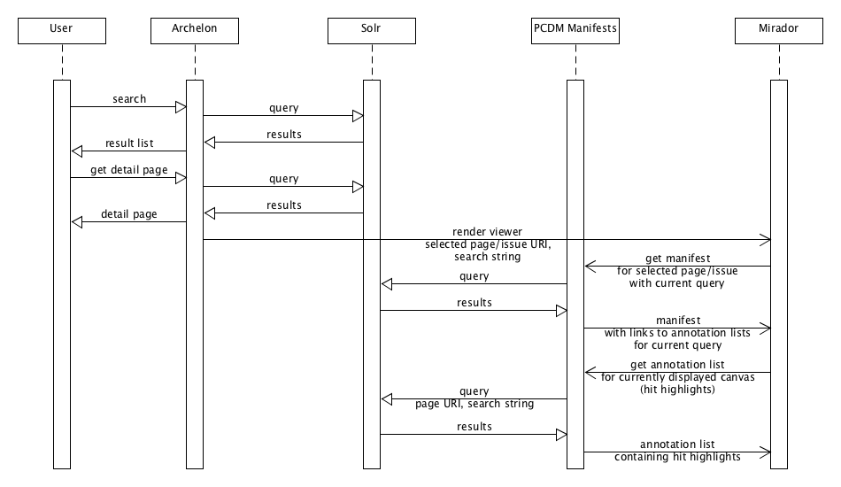

title: OCR Text as Web Annotations
author:
  name: Peter Eichman
  email: peichman@umd.edu
theme: theme
output: index.html

--

# OCR Text as Web Annotations
## UMD Student Newspaper Project

--

### What We Wanted

* Full-text search of OCR text
* Hit highlighting on the images

--

### What We Had

* ALTO XML from the vendor
* Solr index of our Fedora metadata
* IIIF Presentation API service

--

### Technology Choices

* Web Annotations
* <https://www.w3.org/TR/annotation-model/>
* <https://www.w3.org/TR/annotation-vocab/>
* RDF-native
* Annotation lists supported by IIIF

--

### Data Model


--

### RDF

```
<> a oa:Annotation ;
  oa:motivatedBy sc:painting ;
  oa:hasBody [
    a oa:TextualBody ;
    rdf:value """HON.|2556,2906,120,66 RICHARD|2706,2906,211,66 YATES|2946,2906,151,66
ADDRESSES|2698,2997,283,66 STUDENTS|3016,3000,254,63""" ;
    dcterms:format "text/plain"
  ] ;
  oa:hasTarget [
    a oa:SpecificResource ;
    oa:hasSource </pcdm/3b/74/68/30/3b746830-ddc6-423e-860d-076cc7b2ab26> ;
    oa:hasSelector [
      a oa:FragmentSelector ;
      rdf:value "xywh=2553,2902,717,161" ;
      dcterms:conformsTo <http://www.w3.org/TR/media-frags/>
    ]
  ] ;
  # provenance information can be added to show how this annotation was created  
  prov:wasDerivedFrom [
    a oa:SpecificResource ;
    # ALTO XML file
    oa:hasSource </pcdm/d1/0b/b0/2f/d10bb02f-9672-4b84-b477-c01f6580db45> ;
    # the particular alto:TextBlock element
    oa:hasSelector [
      a oa:XPathSelector ;
      rdf:value "//*[@ID='P3_TB00030']"
    ]
  ] .
```

--

### Solr Indexing

* Parse ALTO XML into an intermediate text format
* <https://github.com/umd-lib/newspaper-batchload/blob/develop/classes/ocr.py>
* Use Solr token payloads to store word bounding boxes

  ```
  word|x,y,w,h
    token=word
    payload=x,y,w,h
```

  ```
  hyphen|x1,y1,w1,w2\N{SOFT HYPHEN}ated|x2,y2,w2,h2
    token=hyphenated 
    payload=x1,y1,w1,h1+x2,y2,w2,h2
```

--

### Dynamic Annotation Lists

* Send query to Solr
* Limit to annotations whose source are the current page
* Parse `highlighting` section of Solr results
* Generate a IIIF annotation list
* Link to dynamic annotation list in the main manifest
* <https://github.com/umd-lib/pcdm-manifests/blob/develop/app/controllers/concerns/manifest_helper.rb#L60>

--

### System Interactions



--

### Results

* Query: "student"

  
